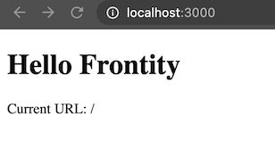

# Create a Theme Package

As stated previously, rather than using the default starter theme that we selected during the setup process (i.e. `@frontity/mars-theme`) we are instead going to develop a custom theme from scratch. To do this we need to create a new package for our theme's code. As it's our first ever theme let's call our theme "my-first-theme".

> **NOTE:** Before continuing you may need to stop the dev server process that we ran previously with _CONTROL+C_.

To create a package run the following command in the terminal:

```bash
> npx frontity create-package my-first-theme
```

You will be prompted to specify the namespace to use. Since you are creating a theme you can use the default `theme`, so you can just press _Enter_ at this point.

<p>
  
</p>

When the process is complete you will have a new directory called `/packages/my-first-theme`. This is where we will be doing most of our work to build the theme.

<p>
  
</p>

The first thing we'll do is to remove `@frontity/mars-theme` from our settings and replace it with `my-first-theme`.

Remove the following from the file `frontity.settings.js`:

```js
// File: /frontity.settings.js

{
  name: "@frontity/mars-theme",
  state: {
    theme: {
      menu: [
        ["Home", "/"],
        ["Nature", "/category/nature/"],
        ["Travel", "/category/travel/"],
        ["Japan", "/tag/japan/"],
        ["About Us", "/about-us/"]
      ],
      featured: {
        showOnList: false,
        showOnPost: false
      }
    }
  }
},
```

And replace it with:

```js
// File: /frontity.settings.js

{
  name: "my-first-theme"
},
```

We've now told Frontity to use our new theme rather than "mars-theme". Save the file and then run this command again:

```bash
> npx frontity dev
```

If you see this in your browser then everything is working. Hooray! 🙌

<p>
  
</p>


**🧐 Check you're on the right track**

For each step in this tutorial we have created a commit in [this repo](https://github.com/frontity-demos/tutorial-hello-frontity/commits/main).

If you get stuck at any point you can compare your code at the relevant stage to the commits in the repo.

> Lines with a 🔴 red background marked with a minus sign ➖ are removed at that step.

> Lines with a 🟢 green background marked with a plus sign ➕ are added at that step.

The changes made in this step [can be seen here](https://github.com/frontity-demos/tutorial-hello-frontity/commit/7733a6c3d9886cf4a86397e8ba1a668fcd3cb928).


