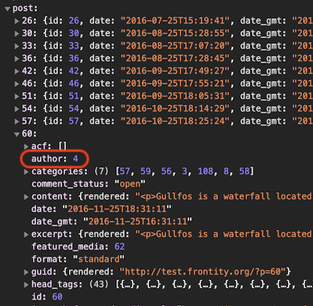
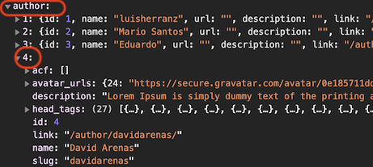

# Display posts and pages separately

We're making great progress and our theme now has a good deal of useful functionality! 🙌

At the moment posts and pages both use the same component. However, normally posts and pages would be displayed differently from one another. Posts, for example, would display author and date information as well as tags, categories, etc..., whereas pages would not.

Let's distinguish between the two now.

Create a new file and call it `page.js`. Copy the contents of `post.js` into `page.js` and rename the component from `<Post>` to `<Page>`. Remember to also change the `export` line - line 18 in the code sample below.

```jsx
// File: /packages/my-first-theme/src/components/page.js

import React from "react"
import { connect } from "frontity"

const Page = ({ state }) => {
  const data = state.source.get(state.router.link)
  const page = state.source[data.type][data.id]

  return (
    <div>
      <h2>{page.title.rendered}</h2>
      <div dangerouslySetInnerHTML={{ __html: page.content.rendered }} />
    </div>
  )
}

export default connect(Page)
```


Here we can see why it was a good idea to use `data.type` rather than hard code `post`, because in this case the type will be `page`.


At the moment `page.js` and `post.js` are pretty much identical, so let's now distinguish between them by adding author and date info to `post.js`.

If we take a look at the data about a post, so for example `frontity.state.source.post[60]`, we can see that the only information we have about the author is the ID.

<p>
  
</p>

We can use this ID to get the actual author information from `state.source.author[ID]`.

<p>
  
</p>

Let's modify the `<Post>` component in `post.js` to get the author information and display both it and the post date.

```jsx
// File: /packages/my-first-theme/src/components/post.js

import React from "react"
import { connect } from "frontity"

const Post = ({ state }) => {
  const data = state.source.get(state.router.link)
  const post = state.source[data.type][data.id]
  const author = state.source.author[post.author]

  return (
    <div>
      <h2>{post.title.rendered}</h2>
      <p>
        <strong>Posted: </strong>
        {post.date}
      </p>
      <p>
        <strong>Author: </strong>
        {author.name}
      </p>
      <div dangerouslySetInnerHTML={{ __html: post.content.rendered }} />
    </div>
  )
}

export default connect(Post)
```

Finally in this section let's change the root component file to import the `<Page>` component, and then use it in the `<Switch>` component to conditionally render it if `data.isPage` is true.

```jsx
// File: /packages/my-first-theme/src/components/index.js

// ...
import Page from "./page"

const Root = ({ state }) => {
  const data = state.source.get(state.router.link)

  return (
    <>
      {/* ... */}
      <Switch>
        <List when={data.isArchive} />
        <Post when={data.isPost} />
        <Page when={data.isPage} />
      </Switch>
    </>
  )
}
```

Now as you navigate around the site and view posts and pages a different component is used for each case and you'll notice that posts, e.g. _"The Beauties of Gullfoss"_, have the author and date info, but pages, e.g. _"About Us"_, do not.

<p>
  
</p>

## Using a single component for both posts and pages


**Note:** This section is optional and can be safely skipped without affecting the learning experience


So far we've created separate `<Post>` and `<Page>` components in separate `post.js` and `page.js` files so that posts and pages can be displayed differently.

Instead of doing that we could have the `<Post>` component conditionally check the `isPost` property and display the posted date and author information only if it is true.

If it is not true but `isPage` is true then this additional information will not be displayed.

This means that we only need one component to display both posts and pages, and so we don't need to make that last change to the root component in `index.js` which can remain as follows:

```jsx
// File: /packages/my-first-theme/src/components/index.js

// ...
<main>
  <Switch>
    <List when={data.isArchive} />
    <Post when={data.isPost} />
    <Post when={data.isPage} />
  </Switch>
</main>
// ...
```

`post.js` could now look like this. It displays the title in an `<h2>` for both posts and pages, displays the posted date and author name only on posts, and then displays the content in either case.

```jsx
// File: /packages/my-first-theme/src/components/post.js

import React from "react"
import { connect } from "frontity"

const Post = ({ state }) => {
  const data = state.source.get(state.router.link)
  const post = state.source[data.type][data.id]
  const author = state.source.author[post.author]

  return (
    <div>
      <h2>{post.title.rendered}</h2>
      {data.isPost && (
        <p>
          <strong>Posted: </strong>
          {post.date}
        </p>
      )}
      {data.isPost && (
        <p>
          <strong>Author: </strong>
          {author.name}
        </p>
      )}
      <div dangerouslySetInnerHTML={{ __html: post.content.rendered }} />
    </div>
  )
}

export default connect(Post)
```


**Please note:** for the rest of this tutorial we will assume that you have gone for separate `post.js` and `page.js` files each with their own component. If you have elected to use the single component with conditionals option you may need to adapt some of the subsequent steps.

