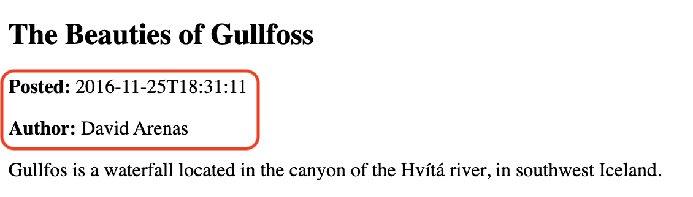
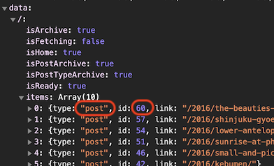
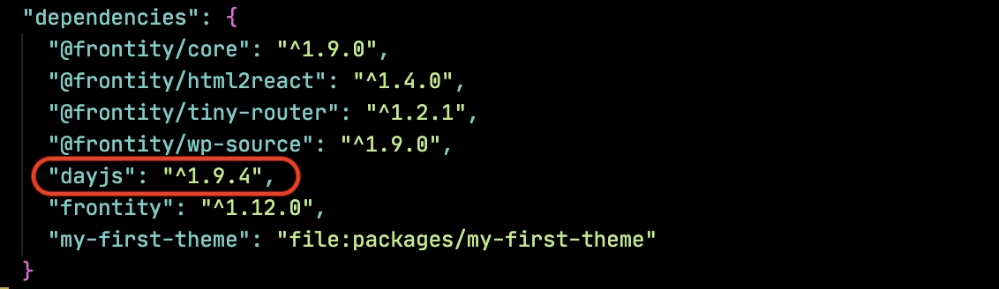
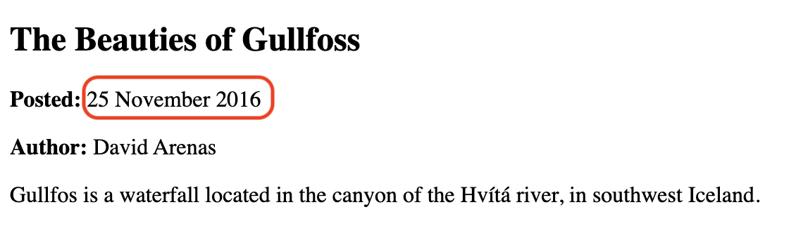
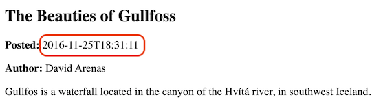

# Display the list of posts

In the last lesson we saw that when we got the data for the homepage with `frontity.state.source.get('/')` that there was an array of `items` which were the posts to display on the homepage. Let's now use that array to display some basic information about each of the posts in our browser.

In order to display the list of posts, let's create a new file in the `components` folder and call it `list.js`.

This will contain a component called `<List>` which will first get the data for the current URL (remember that this is stored in `state.router.link`) using the `get` helper function. It will then use JavaScript's [`array.map`](https://developer.mozilla.org/en-US/docs/Web/JavaScript/Reference/Global_Objects/Array/map) method to iterate over the `items` array and display the `type`, `id` and `link` of each post.


☝️ Remember that you can inspect this data by running `frontity.state.source.get('/')` in the browser's console.


```jsx
// File: /packages/my-first-theme/src/components/list.js

import React from "react"
import { connect } from "frontity"

const List = ({ state }) => {
  const data = state.source.get(state.router.link)

  return (
    <div>
      {data.items.map((item) => {
        return (
          <div key={item.id}>
            {item.type} – {item.id} – {item.link}
          </div>
        )
      })}
    </div>
  )
}

export default connect(List)
```

Next we need to import the `<List>` component into our root component file and use it.

```jsx
// File:  /packages/my-first-theme/src/components/index.js

// ...
import List from "./list"

const Root = ({ state }) => {
  const data = state.source.get(state.router.link)

  return (
    <>
      {/* ... */}
      <main>
        <Switch>
          <List when={data.isArchive} />
          <div when={data.isPost}>This is a post</div>
          <div when={data.isPage}>This is a page</div>
        </Switch>
      </main>
    </>
  )
}
```

Great! Now we can see some information about each of the posts on the `Home` page and on the `More posts` page.

<p>
  
</p>

Now let's change the `<List>` component to get the information about each of the posts and show the title and turn it into a link.

You will recall that getting data in Frontity is a two step process. Let's illustrate this process to help you to fully understand it.

Above we performed the first step and got the data about the URL and worked with each of the items in the `items` array.

<p>
  
</p>

So here we can see that the `items` array for the homepage has a number of posts, the first of which is of type `post` and has the `id` 60.

We can therefore use this information to perform the second step and access the content at `state.source.post[60]` where we can get the title and the link for that post.

<p>
  
</p>

So the second step involves getting the content related to each item in the `items` array, and as we iterate over each item in the array (using `array.map`) we get the post content for each post with:

```jsx
state.source[item.type][item.id]
```

You might think that since they're all of type `post` that we could instead use:

```jsx
state.source.post[item.id]
```

And you'd be right, that would also work. However it's good practice to use the `type` property stored in the data rather than hard code the type. In this case all the items are indeed of type `post`, but that's not necessarily always the case - sometimes we'll work with pages, or attachment images, or authors, etc...

So here's what our `list.js` file is going to look like:

```jsx
// File: /packages/my-first-theme/src/components/list.js

import React from "react"
import { connect } from "frontity"
import Link from "@frontity/components/link"

const List = ({ state }) => {
  const data = state.source.get(state.router.link)

  return (
    <div>
      {data.items.map((item) => {
        const post = state.source[item.type][item.id]
        return (
          <Link key={item.id} link={post.link}>
            {post.title.rendered}
            <br />
          </Link>
        )
      })}
    </div>
  )
}
```

> ☝️ As we're going to make each post title a clickable link remember that we have to import the `<Link>` component into `list.js`!

Now our list page is a series of links to individual posts.

<p>
  
</p>

And if we click a link we can see finally see the text "This is a post".

<p>
  
</p>

However, what we really want to see is the post content. Let's do that next.
