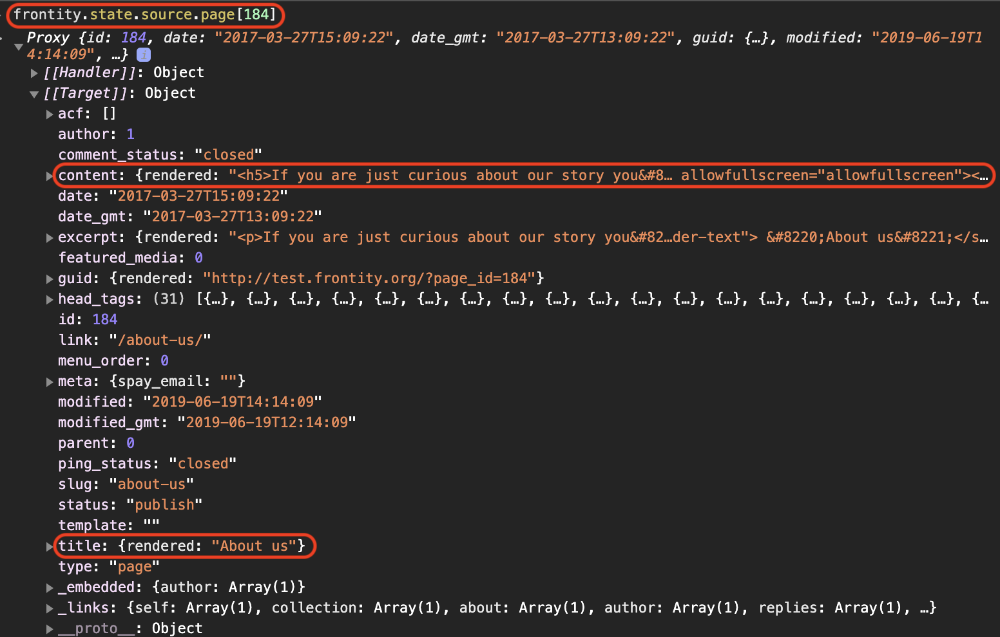

# Understanding the Frontity state

> *__[TO DO]__ modify this text to suit new context.*

> *__[TO DO]__ new images may be required.*

In order to gain a better understanding of Frontity, let’s dig a little deeper and investigate how it works below the surface.

To do so, access `http://localhost:3000/lorem-ipsum/` in the browser and open the console. In the console type `frontity.state` to see the Frontity state. This is the same state that the components and actions have access to.

<p>
  
</p>

> Frontity uses [ES2015 Proxies](https://developer.mozilla.org/en-US/docs/Web/JavaScript/Reference/Global_Objects/Proxy), so you have to open the property [[Target]] in order to see the state.

You will see Frontity's global state, including the general properties of your Frontity project. You can also see information about the `router`, including the `state.router.link` that we used earlier, and `source`, the package that connects Frontity to your WordPress site.

Let’s take a look at `state.source.data`. This is where the information for each URL is stored. If you inspect `/lorem-ipsum/`, you can see that it’s a page, and that it has the ID 146.

<p>
  
</p>

With that information, we can access the data (title, content, etc) of that page with `state.source.page[146]`:

<p>
  
</p>

As you navigate from one URL to another, the package `@frontity/wp-source` automatically fetches everything you need and stores it in `state.source`.

If we open the Network tab (in the browser's devtools) and click on the menu to go to Home (Homepage), you will see that a call to the REST API is made to get the latest posts.

Take another look at `state.source.data`. You will notice that it's been populated with much more data than before.

Please note that instead of using `state.source.data[url]` it’s better to use the `get` helper function: `state.source.get(url)`. This ensures that URLs always include the final slash (/).

So now let’s inspect the homepage using state.source.get("/"):

<p>
  
</p>

As you can see, it has several interesting properties such as `isHome`, `isArchive`, and an array of `items`. If the homepage were a category it would have an `isCategory` property. If it were a post it would have an `isPost` property, etc...

To wrap up this section let's use all of this in our code.

In this next step we **`get`** the information about the current link (`state.router.link`) and use it to see if it’s a `list`, a `post`, or a `page`.

```jsx
// File: /packages/my-first-theme/src/theme-files/index.js

const Root = ({ state }) => {
  const data = state.source.get(state.router.link);

  return (
    <>
      <h1>Frontity Workshop</h1>
      <p>Current URL: {state.router.link}</p>
      <nav>
        <Link href="/">Home</Link>
        <Link href="/page/2">More posts</Link>
        <Link href="/lorem-ipsum">Lorem Ipsum</Link>
      </nav>
      <hr />
      <main>
        {data.isArchive && <div>This is a list</div>}
        {data.isPost && <div>This is a post</div>}
        {data.isPage && <div>This is a page</div>}
      </main>
    </>
  );
};
```