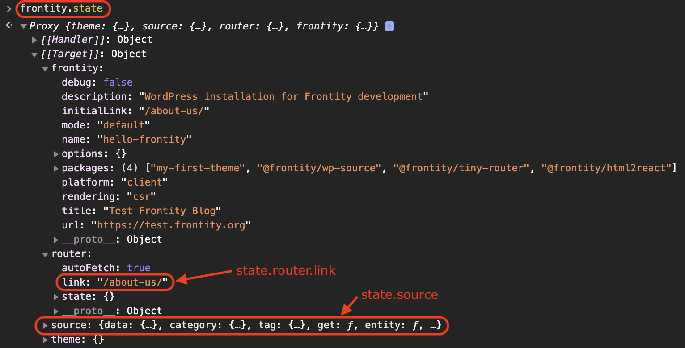
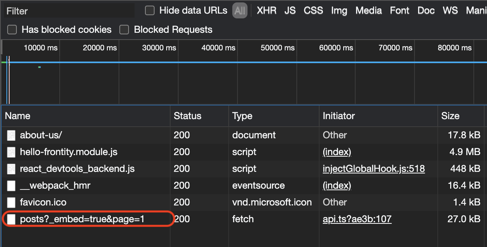

# Understanding the Frontity state

In this lesson we're going to look at the structure of Frontity's "state". An understanding of how the state is structured is crucial when it comes to developing themes and other packages for Frontity.

## The state manager

Frontity has it's own state manager, which functions similarly to Redux or MobX which you may already be familiar with if you have already had some experience working with React. All the data and settings associated with our project are stored in the state.


Frontity's state manager is called "Frontity Connect" and it is based on [react-easy-state](https://github.com/RisingStack/react-easy-state).


## Understanding the Frontity state

To start understanding Frontity's state first access `http://localhost:3000/about-us/` in the browser. The simplest way is to click the link in the menu we've just created. Then - _and this is important_ - refresh the page to clear out the state. This gives us a "blank canvas" version of the state so we can see how it works.

When you've done that [open the browser console](https://webmasters.stackexchange.com/a/77337). In the console type `frontity.state` in order to see the Frontity state.

<p>
  
</p>


Frontity uses [ES2015 Proxies](https://developer.mozilla.org/en-US/docs/Web/JavaScript/Reference/Global_Objects/Proxy), so you have to open the property _`[[Target]]`_ in order to see the state.


You will see Frontity's global state, which as we mentioned earlier includes all the data fetched from WordPress and all the settings and properties of your Frontity project. All the components and actions in our project will have access to this state.

You can see information about the `router`, including the `state.router.link` that we used earlier, which as we now know stores the current URL. You can also see data contained in `state.source`, this is the data fetched by `@frontity/wp-source` which is the package that connects Frontity to your WordPress site.

Let’s take a look at `frontity.state.source.data` in the console. This is where the information for each URL is stored. If you inspect `/about-us/`, you can see that it’s of type `page`, and that it has the `id` 184. Note also that the `isReady` property is set to 'true'. This means the data is ready for use in our application.

<p>
  
</p>

## The two step process

Because Frontity works with the same permalinks that WordPress uses there's a two step process to getting data from the state.

We first get the data about the URL from `state.source.data`. Then armed with the information provided there, crucially the content `type` and the `id` (though we can also check whether the data is ready for retrieval with `isReady`, amongst other things), we can retrieve the actual content.

Let's run through an example to better understand this two step process.

With the information from the first step that the URL `/about-us/` is a page and has the ID 184, we can take the second step and access the data of that page with `frontity.state.source.page[184]`:

<p>
  
</p>

Now we can get such things as the `title` and the `content` to use in our components so that they get rendered in the browser. We also have access to the author ID and the post date. We will look at how we can use these in our components in later lessons.

## Populating the state

Let's now take a look at how the state gets populated.

As you navigate from one URL to another, the package `@frontity/wp-source` automatically fetches everything it needs from the WordPress REST API and stores it in `state.source`.

If we open the Network tab (in the browser's devtools) and click on the menu to go to 'Home', we can see that a call to the REST API is made to get the latest posts.

<p>
  
</p>

Take another look at `frontity.state.source.data`. You will notice that it's now populated with rather more data than before.

Frontity provides the `get` helper function to facilitate the first step of the two step data retrieval process. You should use this rather than attempting to access the data in `state.source.data` directly.

So, instead of using `state.source.data[url]` you should use the `get` helper function: `state.source.get(url)`. This ensures that URLs always include the final slash (/).

So now let’s inspect the information about the homepage using `frontity.state.source.get('/')`:

<p>
  
</p>

As you can see there are several interesting properties such as `isHome`, `isArchive`, and an array of `items`. If the homepage were a category it would have an `isCategory` property. If it were a post it would have an `isPost` property, etc... These are boolean values so we just need to check for their truthiness.

That's enough theory for now. To wrap up this section let's use this new knowledge in our code.

## The Frontity state in practice

In this step we will use the `get` helper function to get the information about the current link (stored in `state.router.link`) and use it inside a `<main>` element to see whether it’s a `list`, a `post`, or a `page`.

To do this we'll use another component provided by Frontity, i.e. the `<Switch>` component. This acts like the 'switch' statement in any programming language, the first matching condition is the one that is executed. But first we need to import the `<Switch>` component, which we do similarly to the way in which we imported the `<Link>` component previously.


You can learn more about the `<Switch>` component [in our docs](https://docs.frontity.org/api-reference-1/frontity-components#switch).


```jsx
// File: /packages/my-first-theme/src/components/index.js
import Switch from "@frontity/components/switch"

const Root = ({ state }) => {
  const data = state.source.get(state.router.link)

  return (
    <>
      <h1>Hello Frontity</h1>
      <p>Current URL: {state.router.link}</p>
      <nav>
        <Link link="/">Home</Link>
        <br />
        <Link link="/page/2">More posts</Link>
        <br />
        <Link link="/about-us">About Us</Link>
      </nav>
      <hr />
      <main>
        <Switch>
          <div when={data.isArchive}>This is a list</div>
          <div when={data.isPost}>This is a post</div>
          <div when={data.isPage}>This is a page</div>
        </Switch>
      </main>
    </>
  )
}
```

Since we don't yet have any links to any posts the second condition will never be satisfied, so we won't ever see the text "This is a post" come up. Let's go on to address that.
