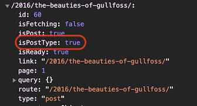
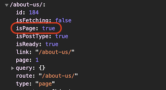

# Add dynamic styling

> *__[TO DO]__ modify this text to suit new context.*

> *__[TO DO]__ add more explanation and another example here.*

One of the great features of CSS-in-JS is that it allows us to modify the styling of elements dynamically. Let's take a look at how we can do this.

You will recall that in the previous section we added an 8px wide border to the bottom of our header. We'll use that to indicate whether we're on a `list` page, a `post` page, or a `page`, erm..., page 🤷🏻‍♂️ by changing the colour of the border.

To do this we add a prop to the `<Header>` component.

```jsx
// File: /packages/my-first-theme/src/components/index.js

// ...
<Header isPostType={data.isPostType}>
// ...
```

This prop gets passed to a function that we add to our CSS that conditionally checks the boolean value passed in to determine what colour the border should be, i.e. either green in the case of a `post` or `page`, or maroon in the case of a `list`. We're no longer using JSX here so we need to prepend the function with a $ sign, and we also need to use the ternary operator - we cannot use `if...then...else` in JavaScript embedded within a template literal.

```jsx
// File: /packages/my-first-theme/src/components/index.js

// ...
const Header = styled.header`
  background-color: #E5EDEE;
  border-width: 0 0 8px 0;
  border-style: solid;
  border-color: ${ props => props.isPostType ? 'lightseagreen' : 'maroon'};
`
```

Let's extend this to get a different colour for pages. __Note__ that here we have a ternary operator as the _ifTrue_ expression within our original ternary operator!!!

```jsx
// File: /packages/my-first-theme/src/components/index.js

// ...
<Header isPostType={data.isPostType} isPage={data.isPage}>
// ...

// ...
const Header = styled.header`
  background-color: #E5EDEE;
  border-width: 0 0 8px 0;
  border-style: solid;
  border-color: ${ props => props.isPostType ? ( props.isPage ? 'lightsteelblue' : 'lightseagreen' ) : 'maroon'};
`
```

Now if we navigate to `Home` the header has a maroon border (as it's a listing page), if we click on one of the posts the post page has a green border, and if we navigate to `About Us`, (which is a page rather than a post) the header has a blue border.

Awesome, our site is starting to look pretty good now! 👌

<p>
  
</p>

<p>
  
</p>

<p>
  
</p>