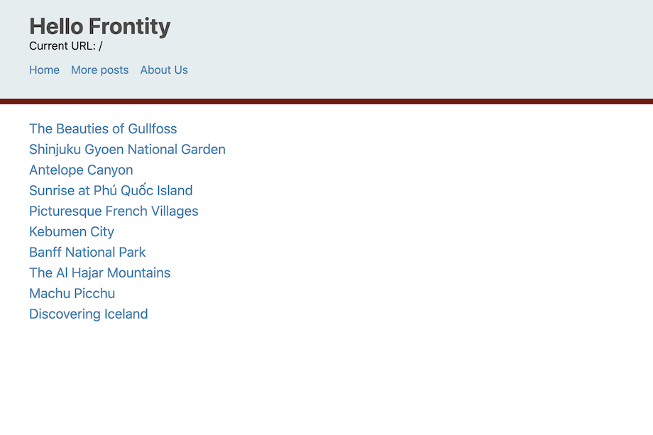
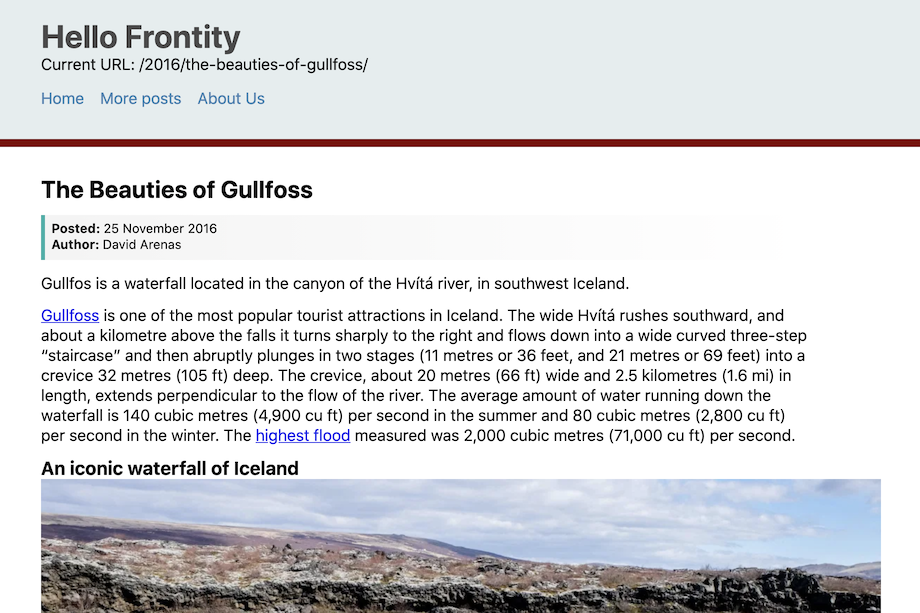

# Styled components

> *__[TO DO]__ modify this text to suit new context.*

> *__[TO DO]__ this section is long - consider splitting it into 2 or more sections.*

In this section we're going to create some CSS components, also known as styled components. These components are created using `styled`, which like `css` is a function. However the HTML tag that you want to style is appended with dot notation and then, again like `css`, the function takes a template literal containing CSS as it's argument.

As a basic example let's start by creating a `<Header>` component and give it a background colour, though first we need to import `styled` from Frontity.

```jsx
// File: /packages/my-first-theme/src/components/index.js

// ...
import { connect, Global, css, styled } from "frontity";
// ...

const Header = styled.header`
  background-color: #E5EDEE;
`
```

Once the `<Header>` component has been created let's use it in our root component to wrap all the elements that we want contained in the header section of our site.

```jsx
// File: /packages/my-first-theme/src/components/index.js

// ...
const Root = ({ state }) => {

  const data = state.source.get(state.router.link)

  return (
    <>
      <Global
        styles={css`
        html {
            font-family:  system-ui, Verdana, Arial, sans-serif;
        }
      `}
      />
      <Header>
        <h1>Frontity Workshop</h1>
        <p>Current URL: {state.router.link}</p>
        <nav>
          <Link href="/">Home</Link>
          <Link href="/page/2">More posts</Link>
          <Link link="/about-us">About Us</Link>
        </nav>
      </Header>
      <main>
        {data.isArchive && <List />}
        {data.isPost && <Post />}
        {data.isPage && <Page />}
      </main>
    </>
  );
};
```

Now our header is contained within a nice light grey background. But notice the rather ugly white border around it. Let's fix that by applying a basic CSS reset to our `<Global>` component.

```jsx
// File: /packages/my-first-theme/src/components/index.js

// ...
<Global
  styles={css`
    * {
        padding: 0;
        margin: 0;
        box-sizing: border-box;
    }
    html {
        font-family: system-ui, Verdana, Arial, sans-serif;
    }
  `}
/>
// ...
```

CSS reset can be [much more elaborate](https://meyerweb.com/eric/tools/css/reset/) than this, but this simple CSS reset will give us more control over the styling of our elements going forward, and enable us to have more consistent and predictable behaviour.

Let's continue styling our header by adding a border to the bottom, and making the `<h1>` element within it a little less starkly black!

```jsx
// File: /packages/my-first-theme/src/components/index.js

// ...

const Header = styled.header`
  background-color: #E5EDEE;
  border-width: 0 0 8px 0;
  border-style: solid;
  border-color: maroon;

  h1 {
    color: #4a4a4a;
  }
`
```

We also want to constrain our page width to 800px. To do that we will need to add a couple of extra components, `<HeaderContent>` and `<Main>`. Let's add these, and we'll also style some elements within Main.

```jsx
// File: /packages/my-first-theme/src/components/index.js

// ...
const Header = styled.header`
  background-color: #E5EDEE;
  border-width: 0 0 8px 0;
  border-style: solid;
  border-color: maroon;
`
const HeaderContent = styled.div`
    max-width: 800px;
    padding: 2em 1em;
    margin: auto;
`
const Main = styled.main`
    max-width: 800px;
    padding: 1em;
    margin: auto;

    img {
        max-width: 100%;
    }
    h2 {
        margin: 0.5em 0;
    }
    p {
        line-height: 1.25em;
        margin-bottom: 0.75em;
    }
`
```

Since all post and page content is going to appear within the `<Main>` component you can keep adding elements to the definition of that component and styling them as you wish. Thus far we've only applied some minimal styling to the `img`, `h2`, and `p` elements.

Now let's use those styled components in our root component.

```jsx
// File: /packages/my-first-theme/src/components/index.js

// ...
const Root = ({ state, actions }) => {

  const data = state.source.get(state.router.link)

  return (
    <>
      <Global
        styles={css`
        * {
            padding: 0;
            margin: 0;
            box-sizing: border-box;
        }
        html {
            font-family: system-ui, Arial, sans-serif;
        }
      `}
      />
      <Header>
        <HeaderContent>
          <h1>Frontity Workshop</h1>
          <p>Current URL: {state.router.link}</p>
          <nav>
            <Link href="/">Home</Link>
            <Link href="/page/2">More posts</Link>
            <Link link="/about-us">About Us</Link>
          </nav>
        </HeaderContent>
      </Header>
      <Main>
        {data.isArchive && <List />}
        {data.isPost && <Post />}
        {data.isPage && <Page />}
      </Main>
    </>
  );
};
```

Next we'll turn our attention back to the header section and style the menu. We'll make our links a consistent colour and remove the underlines so that it looks a bit cleaner.

```jsx
// File: /packages/my-first-theme/src/components/index.js

// ...
const Menu = styled.nav`
    display: flex;
    flex-direction: row;
    margin-top: 1em;
    & > a {
        margin-right: 1em;
        color: steelblue;
        text-decoration: none;
    }
`
```

It remains for us to replace the `nav` element in our `Root` component with the new `Menu` component.

```jsx
// File: /packages/my-first-theme/src/components/index.js

// ...
 <Header>
  <HeaderContent>
    <h1>Frontity Workshop</h1>
    <p>Current URL: {state.router.link}</p>
    <Menu>
      <Link href="/">Home</Link>
      <Link href="/page/2">More posts</Link>
      <Link link="/about-us">About Us</Link>
    </Menu>
  </HeaderContent>
</Header>
// ...
```

We now have a pleasing looking header.

Let's improve the appearance of our `<List>` component by having our links in the same style as the menu. Open `list.js` and add an `<Items>` component and use it with `<List>`. Remember also to import `styled` from `frontity`.

```jsx
// File: /packages/my-first-theme/src/components/list.js

import React from "react"
import { connect, styled } from "frontity"
import Link from "./link"

const List = ({ state }) => {
  const data = state.source.get(state.router.link);

  return (
    <Items>
      {data.items.map(item => {
        const post = state.source.post[item.id];
        return (
          <Link href={post.link} key={post.id}>
            {post.title.rendered}
          </Link>
        );
      })}
    </Items>
  );
};

const Items = styled.div`
  & > a {
    display: block;
    margin: 6px 0;
    font-size: 1.2em;
    color: steelblue;
    text-decoration: none;
  }
`
```

Finally for this section we'll highlight the author and date info in our `<Post>` component. Import `styled` into `post.js` and create and use a `<PostInfo>` component.

```jsx
// File: /packages/my-first-theme/src/components/post.js

import React from "react"
import { connect, styled } from "frontity"

const Post = ({ state }) => {
    const data = state.source.get(state.router.link)
    const post = state.source[data.type][data.id]
    const author = state.source.author[post.author]

    return (
        <div>
            <h2>{post.title.rendered}</h2>
            <PostInfo>
                <p><strong>Posted: </strong>{post.date}</p>
                <p><strong>Author: </strong>{author.name}</p>
            </PostInfo>
            <div dangerouslySetInnerHTML={{ __html: post.content.rendered}} />
        </div>
    )
}

export default connect(Post)

const PostInfo = styled.div`
    background-image: linear-gradient(to right, #f4f4f4, #fff);
    margin-bottom: 1em;
    padding: 0.5em;
    border-left: 4px solid lightseagreen;
    font-size: 0.8em;

    & > p {
        margin: 0;
    }
`
```

For reference, this is how your site should be looking like now:

<p>
  
</p>

<p>
  
</p>