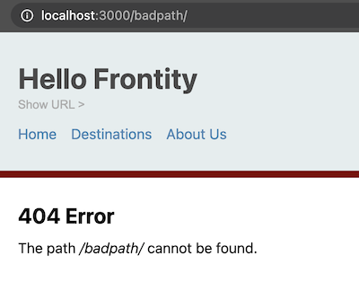

# Add a 404 page

This is a nice easy step. All we need to do here is create a component to inform the user that the page can't be found and then use it in our `<Root>` component.

First create a new file in the `components` folder which will be called `error.js`. Put this code in the file:

```jsx
// File: /packages/my-first-theme/src/components/error.js

import React from "react";
import { connect } from "frontity";

const Error = ({state}) => {

    return(
        <>
            <h2>404 Error</h2>
            <p>The path <em>{state.router.link}</em> cannot be found.</p>
        </>
    )
}

export default connect(Error)
```

It's not really necessary to connect the component to the state if you just want to display a simple error message, but here we want to show the path that resulted in the 404 error.

It remains for us to use it in our `<Root>` component. First we import the `<Error>` component, then we add it as the last item in our `<Switch>` component which selects what component to use depending on the first matching condition.

```jsx
// File: /packages/my-first-theme/src/components/index.js

// ...
import Error from "./error";

// ...
<Switch>
    <Loading when={data.isFetching} />
    <List when={data.isArchive} />
    <Page when={data.isPage} />
    <Post when={data.isPost} />
    <Page when={data.isDestinations} />
    <Error when={data.isError} />
</Switch>
// ...
```

And that's it! As we said earlier, this was a nice easy step. Now if you try navigating to a path that doesn't exist the `<Error>` component will display informing the user of the error.

<p>
  
</p>