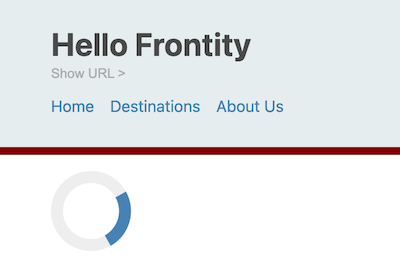

# Add a `<Loading>` component

One great thing about Frontity is that a lot of the content is pre-fetched into the state so page transitions are virtually instant. Sometimes, however, the content is not already in the state and Frontity must fetch it from the WordPress REST API.

Doing this is not instant. You can see this by selecting the `About Us` menu option. Depending on your network speed you may notice a slight delay and the content area of our page remains empty.


If you're not noticing this delay you could try emulating a slow network connection in the network tab of your browser's Dev Tools.

Also don't forget to reload the home page so that the state is cleared and refreshed.


Whenever there's a delay such as occurs while data is being fetched it's a good idea to indicate to the user that something is actually happening, so let's add a `<Loading>` component.

Create a new file in the `components` folder and call it `loading.js`. Add the following code:

```jsx
// File: /packages/my-first-theme/src/components/loading.js

import React from "react";
import { styled, keyframes } from "frontity";

const spin = keyframes`
    0% { transform: rotate(0deg); }
    100% { transform: rotate(360deg); }
`

const Loading = () => <Loader />

export default Loading;

const Loader = styled.div`
    border: 12px solid #eee;
    border-top: 12px solid steelblue;
    border-radius: 50%;
    width: 80px;
    height: 80px;
    animation: ${spin} 2s linear infinite;
`
```

As well as `styled` we also import `keyframes` from `frontity`. This function works in a similar way to `styled` and takes a tagged template literal as it's argument. See [our docs](https://docs.frontity.org/api-reference-1/frontity#keyframes) for more info.

Here we're passing in the animation frames that we want, and assigning it to a variable `spin` which we then go on to use in the `animation` property of our `<Loader>` component.

Note that the `<Loading>` component doesn't need to access the state so we don't need to pass it to the `connect` higher order component when we export it.

Now we need to display it. Let's add it as the first item in the `<Switch>` component that's within our `<Root>` component.

```jsx
// File: /packages/my-first-theme/src/components/index.js

// ...
<Main>
  <Switch>
    <Loading when={data.isFetching} />
    <List when={data.isArchive} />
    <Page when={data.isPage} />
    <Post when={data.isPost} />
    <Page when={data.isDestinations} />
  </Switch>
</Main>

// ...
```

Now as we transition between pages our loading spinner is displayed whenever data is being fetched in the background. Sweet! 👌

<p>
  
</p>


By the way, our loader was based on [the one described here](https://www.w3schools.com/howto/howto_css_loader.asp).
