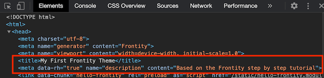

# Add tags to the `<head>` element

We're getting pretty close to having a finished site now, one that is fully-featured and looks good. But how is anyone going to find it?

One thing we've yet to take into account is SEO. To boost the chances of our site appearing in the search engine listings we'll add some tags to the `<head>` element of our document. Tags such as `title` and `description` can be important for SEO so it's good practice if our theme includes them.

Frontity provides a `<Head>` component that can be used to add tags to the HTML `<head>` element.

Let's import the `<Head>` component into our root component file. Then anything that we include within `<Head>...</Head>` tags in our component will be included in the `<head>` section of the HTML document sent to the browser.

```jsx
// File: /packages/my-first-theme/src/components/index.js

import { ..., Head } from "frontity";

// ...

const Root = ({ state, actions }) => {
  const data = state.source.get(state.router.link);

  return (
    <>
      <Head>
        <title>My First Frontity Theme</title>
        <meta
          name="description"
          content="Based on the Frontity step by step tutorial"
        />
      </Head>
      ...
    </>
  );
};
```

With this code added you should already see the title appearing in the tab of you browser, and if you check your document with the browser devtools you should see the title and the description showing up.

<p>
  
</p>

You can include the `<Head>` component wherever you like, there’s no need for it to be in the `<Root>` component of the theme. Additionally you can use variables so that the tags change dynamically according to the content.

Let's put the post title in the `<title>` element and the post excerpt in the `meta description` tag on post pages. As before, we'll import the `<Head>` component into `post.js` and use it within the returned element. But instead of the strings that we used before we'll populate the content of the elements with data from the post.

```jsx
// File: /packages/my-first-theme/src/components/post.js
import { connect, styled, Head } from "frontity"
// ...

const Post = ({ state, libraries }) => {
  // ...
  return (
    <div>
      <Head>
        <title>{post.title.rendered}</title>
        <meta name="description" content={post.excerpt.rendered} />
      </Head>
      <h2>...</h2>
      // ...
    </div>
  )
}
```

Now if you check in your browser devtools you'll see the title and meta description for each post corresponds to the title and excerpt that is held in the state for that post. Also the browser tab helpfully shows the title of the post rather than the previous generic title.

<p>
  
</p>

<p>
  
</p>

Why not try the same exercise for `page.js` and then test the results using the `About Us` page.
